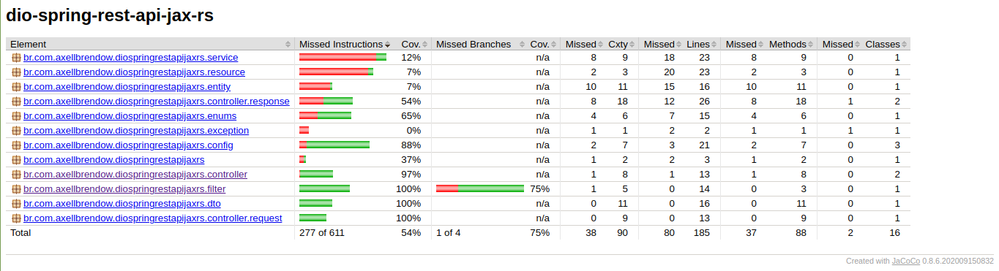

# dio-spring-rest-api-jax-rs

## Running the project

```sh
gradle booRun
```

## Testing the project

```sh
gradle test
```

### Code coverage report

After running `gradle test`, you can get the code coverage report at `build/reports/jacoco/test/html/index.html`.


